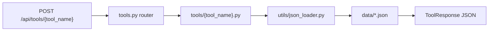
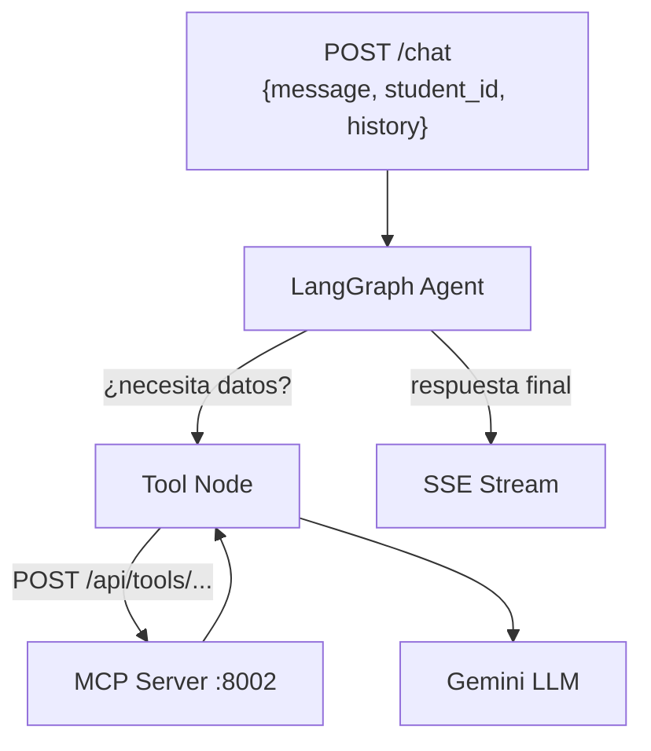
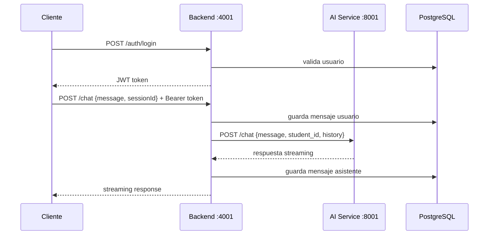
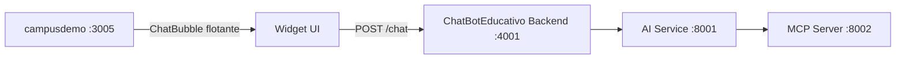

# Plan: ChatBotEducativo

## Contexto de los proyectos analizados

**ChatBotInteligente** es el template a clonar: monorepo por carpetas (`ai-service/`, `backend/`, `frontend/`, `mcp-server/`, `infrastructure/`), sin package.json raíz. Un `docker-compose.yml` en `infrastructure/` levanta todos los servicios.

**campusdemo** es un prototipo Next.js 14 sin backend. Todos los datos viven en `src/data/*.ts`. De esos mocks se derivarán los JSONs del MCP Server.

---

## Arquitectura objetivo

```mermaid
flowchart LR
  Widget[Burbuja campusdemo] -->|POST /chat| BE[Backend NestJS :4001]
  FE[Chat Frontend :3001] -->|POST /chat| BE
  BE --> AI[AI Service :8001\nFastAPI + LangGraph]
  AI -->|POST /api/tools/{tool}| MCP[MCP Server :8002\nFastAPI + JSONs]
  MCP --> JSON[(JSON data files)]
  BE --> PG[(PostgreSQL)]
  AI --> PG
```

---

## Estructura del monorepo

```
ChatBotEducativo/
├── ai-service/           # FastAPI + LangGraph, agente educativo
├── backend/              # NestJS: auth, sesiones, mensajes, proxy a AI
├── frontend/             # Next.js: interfaz de chat standalone + widget embebible
├── mcp-server/           # FastAPI: tools educativas que leen JSON
│   └── data/             # JSONs derivados de campusdemo/src/data/
├── infrastructure/
│   ├── docker-compose.yml
│   └── .env.example
└── docs/
```

---

## Datos y herramientas (MCP Server)

Los JSONs en `mcp-server/data/` se derivan directamente de los mocks de campusdemo:

| JSON file | Fuente campusdemo | Contiene |
|---|---|---|
| `students.json` | `mockData.ts` → `users` | 3 usuarios con matricula, streaks, horas, especialidad |
| `enrolled_courses.json` | `mockData.ts` → `courses` | 3 cursos inscritos con módulos, lecciones, progreso % |
| `course_catalog.json` | `catalogStoreData.ts` | 31 cursos de tienda con precio, nivel, categoría |
| `learning_paths.json` | `learningPathsData.ts` | 11 rutas con nodos, prereqs, status |
| `student_stats.json` | `userStatsData.ts` | 25 cursos acreditados, 6 dimensiones RPG, XP |
| `announcements.json` | `mockData.ts` → notices | 10 avisos (eventos, noticias, promociones) |
| `planteles.json` | `plantelesData.ts` | 18 planteles con lat/lng, especialidades |
| `invoices.json` | `mockData.ts` → invoices | Facturas CFDI mock |

### Tools del MCP Server

| Tool | Descripción | Parámetros |
|---|---|---|
| `get_student_profile` | Perfil del alumno actual | `student_id` |
| `get_enrolled_courses` | Mis cursos con progreso | `student_id` |
| `get_course_detail` | Módulos y lecciones de un curso | `course_id` |
| `search_course_catalog` | Buscar cursos disponibles | `query`, `category?`, `level?` |
| `get_learning_paths` | Rutas de aprendizaje disponibles | `specialty?` |
| `get_student_stats` | Historial RPG, XP, cursos acreditados | `student_id` |
| `get_certificates` | Constancias obtenidas | `student_id` |
| `get_announcements` | Avisos, eventos y noticias | `type?` |
| `get_planteles` | Sedes y ubicaciones | `city?` |
| `get_invoices` | Historial de pagos/facturas | `student_id` |

---

## Stack tecnológico (versiones estables)

Versiones objetivo alineadas con **ChatBotInteligente** (últimas estables al momento del proyecto):

| Capa | Tecnología | Versión |
|------|------------|---------|
| Frontend | Next.js (App Router) | **16.0.x** |
| Frontend | React | **19.x** |
| Frontend | TypeScript | **5.x** |
| Frontend | Tailwind CSS | **3.4.x** |
| Frontend | TanStack Query | **5.x** |
| Frontend | Vercel AI SDK | **3.x** |
| Frontend | Zustand | **5.x** |
| Backend | NestJS | **10.3.x** |
| Backend | TypeORM | **0.3.x** |
| Backend | PostgreSQL | **16** (Alpine en Docker) |
| AI Service | FastAPI | **0.109.x** |
| AI Service | LangGraph | **1.0.x** |
| AI Service | LangChain | **0.3.x** |
| AI Service | Gemini (langchain-google-genai) | **2.x** |
| AI Service — modelo default | `gemini-3.5-flash` | Reemplazo de `gemini-2.5-flash` (retiro ~oct 2026) |
| AI Service — fallback | `gemini-3.5-flash-lite` | Tareas más ligeras |
| MCP Server | FastAPI | **0.115.x** |
| MCP Server | Pydantic | **2.x** |
| Runtime Python | Python | **3.11+** |
| Runtime Node | Node.js | **20 LTS** |

> El frontend de **ChatBotEducativo** usará **Next.js 16** (no 14 como campusdemo). campusdemo se integrará en Fase 7 sin cambiar su versión actual.

---

## Componentes por servicio

### `mcp-server/` (FastAPI)
- Puerto: **8002**
- `app/main.py` — FastAPI app
- `app/routers/tools.py` — `POST /api/tools/{tool_name}`
- `app/tools/` — un módulo por tool educativa
- `app/data/` — JSONs (fuente única de datos)
- `requirements.txt`: `fastapi`, `uvicorn`, `pydantic`

### `ai-service/` (FastAPI + LangGraph)
- Puerto: **8001**
- Agente único `educational_agent` (LangGraph) que selecciona la tool adecuada
- `app/agents/educational_agent.py` — grafo LangGraph
- `app/routers/chat.py` — `POST /chat`
- `app/tools/mcp_client.py` — cliente HTTP al MCP Server
- `app/schemas/` — `ChatRequest`, `ChatResponse`
- LLM: Gemini (igual que ChatBotInteligente)

### `backend/` (NestJS)
- Puerto: **4001**
- Módulos mínimos: `HealthModule`, `AuthModule` (JWT simple), `SessionsModule`, `MessagesModule`, `ChatModule` (proxy a AI Service)
- `GET /health`, `POST /auth/login`, `POST /chat`, `GET /sessions/:id/messages`
- TypeORM + PostgreSQL para persistir sesiones y mensajes

### `frontend/` (Next.js 16)
- Puerto: **3001**
- **Next.js 16** + React 19 + TypeScript 5
- Interfaz de chat standalone para pruebas
- Componente `<ChatBubble />` exportable para integrar en campusdemo
- Vercel AI SDK streaming + TanStack Query

### `infrastructure/`
- **Un único `docker-compose.yml`** que levanta los 6 servicios: `postgres`, `backend`, `ai-service`, `mcp-server`, `frontend`, y un `pgadmin` opcional para desarrollo
- Sin Redis ni Chroma en v1 (simplificado respecto a ChatBotInteligente)
- Un solo `.env` y un `.env.example` documentado para todo el stack
- Comando de arranque completo: `docker compose --env-file .env up -d --build`
- Para VPS: el mismo compose funciona en producción; cada servicio expone solo el puerto necesario (backend en 4001, frontend en 3001, ai-service y mcp-server solo en red interna Docker)

---

## Estándar de tamaño de archivos

Para mantener el código mantenible, legible y fácil de revisar, se aplican estos umbrales **en todos los servicios** (Python y TypeScript):

| Umbral | Líneas | Acción |
|---|---|---|
| Normal | hasta 400 | Sin acción |
| Revisar | 401 – 600 | Evaluar si conviene extraer helpers |
| Advertencia | 601 – 800 | **Refactorizar:** extraer a utilities, helpers o submódulos antes de continuar |
| Límite fuerte | 801 – 1000 | Solo justificado en archivos de datos (JSONs de fixtures) |
| Prohibido | +1000 | Nunca; si ocurre, dividir obligatoriamente antes de hacer commit |

### Estrategias de división por servicio

- **Python (ai-service / mcp-server):** separar en `utils/`, `helpers/`, submódulos dentro de `tools/` o `services/`; cada clase/función con responsabilidad única
- **NestJS (backend):** extraer lógica a providers o decorators propios; `*.util.ts`, `*.helper.ts`, `*.constants.ts`
- **Next.js (frontend):** custom hooks (`use*.ts`), componentes atómicos, helpers en `lib/`
- **JSONs de datos:** los archivos de datos en `mcp-server/data/` pueden superar 1000 líneas porque son fixtures, no lógica

Esta regla se revisará en cada fase antes de avanzar a la siguiente.

---

## Preguntas naturales que el chatbot podrá responder

- "¿Cuántos cursos llevo completados?"
- "¿Cuál es mi progreso en el curso de Yaskawa?"
- "¿Qué cursos están disponibles sobre automatización?"
- "¿Cuáles son mis certificados obtenidos?"
- "¿Cuántas horas de capacitación tengo acumuladas?"
- "¿Qué ruta de aprendizaje me recomiendas para Mecatrónica?"
- "¿Cuándo es el próximo evento en el plantel de León?"
- "¿Cuáles son mis facturas pendientes?"
- "¿En qué sedes ofrecen el curso de PLC Siemens?"

---

## Fases de desarrollo

> Cada fase termina con una **validación local** antes de avanzar a la siguiente. El stack se construye de adentro hacia afuera: datos → MCP → AI → Backend → Frontend → Docker → Integración.

---

### Fase 0 — Scaffold del monorepo

**Qué se construye:**
- Carpeta raíz `ChatBotEducativo/` con todas las subcarpetas vacías (`ai-service/`, `backend/`, `frontend/`, `mcp-server/`, `infrastructure/`, `docs/`)
- `.gitignore` global (node_modules, __pycache__, .env, .next, dist)
- `docs/README.md` con arquitectura, puertos y comandos de arranque
- `infrastructure/.env.example` con todas las variables del stack documentadas
- `infrastructure/docker-compose.yml` esqueleto (servicios definidos, sin build todavía)
- `COMO-INICIAR.md` en raíz con guía paso a paso por fase

**Validación local:**
```
ls ChatBotEducativo/          # estructura de carpetas OK
cat infrastructure/.env.example  # variables documentadas
```

**Criterio de avance:** estructura de carpetas creada, `.env.example` completo, README legible.

**Estado:** ✅ Completada

---

### Fase 1 — Datos JSON (fuente de verdad)

**Qué se construye** en `mcp-server/data/`:
- `students.json` — 3 perfiles (estudiante, instructor, admin)
- `enrolled_courses.json` — cursos inscritos por alumno (`user-01` → 4 cursos con módulos/lecciones)
- `course_catalog.json` — 31 cursos de tienda
- `learning_paths.json` — 11 rutas de aprendizaje con nodos
- `student_stats.json` — 25 cursos acreditados, 6 dimensiones RPG, 18 sub-skills, resumen XP
- `certificates.json` — 25 constancias derivadas de `completedCoursesHistory`
- `announcements.json` — 10 avisos (eventos, noticias, promociones)
- `planteles.json` — 18 sedes IECA
- `invoices.json` — 2 facturas CFDI del alumno `user-01`

**Script de regeneración:** `scripts/export-campus-data.ts`

```powershell
npx tsx --tsconfig scripts/tsconfig.json scripts/export-campus-data.ts
```

**Validación local:**
```powershell
Get-Content mcp-server\data\students.json | ConvertFrom-Json
Get-ChildItem mcp-server\data\*.json | ForEach-Object { Get-Content $_.Name | ConvertFrom-Json | Out-Null; $_.Name }
```

**Criterio de avance:** 9 JSONs válidos, datos suficientes para responder las 9 preguntas tipo del chatbot.

**Estado:** ✅ Completada

---

### Fase 2 — MCP Server (tools educativas)

**Qué se construye** en `mcp-server/`:
- `app/main.py` — FastAPI, puerto **8002**, Swagger en `/docs`
- `app/routers/tools.py` — `POST /api/tools/{tool_name}`, `GET /health`
- `app/tools/` — 10 módulos (uno por tool), cada uno lee su JSON correspondiente
- `app/schemas/` — `ToolRequest`, `ToolResponse` con Pydantic v2
- `app/utils/json_loader.py` — helper reutilizable para leer JSONs (evita repetición)
- `Dockerfile` + `requirements.txt`

**Diagrama de flujo interno:**



**Validación local** (servicio corriendo con `uvicorn`):
```bash
# Levantar
cd mcp-server && uvicorn app.main:app --port 8002 --reload

# Probar tools
curl -X POST http://localhost:8002/api/tools/get_student_profile \
  -H "Content-Type: application/json" \
  -d '{"student_id": "user-01"}'

curl -X POST http://localhost:8002/api/tools/search_course_catalog \
  -d '{"query": "automatización", "level": "intermedio"}'

# Swagger
start http://localhost:8002/docs
```

**Criterio de avance:** las 10 tools responden JSON correcto, `/health` retorna `{"status":"ok"}`, Swagger carga sin errores.

**Estado:** ✅ Completada

---

### Fase 3 — AI Service (agente LangGraph educativo)

**Qué se construye** en `ai-service/`:
- `app/main.py` — FastAPI, puerto **8001**
- `app/routers/chat.py` — `POST /chat` (streaming SSE) y `GET /health`
- `app/agents/educational_agent.py` — grafo LangGraph con nodo de reasoning y tool selection
- `app/tools/mcp_client.py` — cliente `httpx.AsyncClient` que llama al MCP Server
- `app/tools/edu_tools.py` — wrappers LangChain para cada tool del MCP (10 tools)
- `app/schemas/` — `ChatRequest`, `ChatResponse`, `ToolContext`
- `app/prompts/system_prompt.py` — system prompt Campus IECA (rol, tono, límites)
- `app/services/llm_factory.py` — inicialización Gemini
- `Dockerfile` + `requirements.txt`

**Diagrama del agente:**



**Validación local** (MCP Server debe estar corriendo):
```bash
cd ai-service && uvicorn app.main:app --port 8001 --reload

# Preguntas de prueba
curl -X POST http://localhost:8001/chat \
  -d '{"message": "¿Cuántos cursos tengo inscritos?", "student_id": "user-01"}'

curl -X POST http://localhost:8001/chat \
  -d '{"message": "¿Qué rutas hay para Mecatrónica?", "student_id": "user-01"}'
```

**Criterio de avance:** el agente responde de forma coherente a las 9 preguntas tipo, selecciona la tool correcta en cada caso, sin alucinaciones de datos.

**Estado:** ✅ Completada

**Modelo LLM:** `gemini-3.5-flash` (Google retira `gemini-2.5-flash` ~octubre 2026; ver [deprecations](https://ai.google.dev/gemini-api/docs/deprecations)).

---

### Fase 4 — Backend NestJS

**Qué se construye** en `backend/`:
- `src/health/` — `GET /health`
- `src/auth/` — `POST /auth/login` con JWT simple (email + password contra tabla users seed)
- `src/sessions/` — CRUD de sesiones (`POST /sessions`, `GET /sessions/:id`)
- `src/messages/` — persistencia de mensajes por sesión
- `src/chat/` — `POST /chat` proxy al AI Service + guarda mensaje en BD
- TypeORM + PostgreSQL, migraciones automáticas en arranque dev
- Seed inicial: 3 usuarios que coinciden con `students.json`
- `Dockerfile` + `package.json`

**Diagrama de flujo:**



**Validación local** (AI Service y PostgreSQL deben estar corriendo):
```powershell
cd backend && npm run start:dev

# Login
curl -X POST http://localhost:4001/auth/login `
  -d '{"email":"carlos.ramirez@ieca.edu.mx","password":"1234"}'

# Chat con token
curl -X POST http://localhost:4001/chat `
  -H "Authorization: Bearer <token>" `
  -d '{"message":"¿Cuántas horas de capacitación tengo?","sessionId":"ses-01"}'
```

**Criterio de avance:** login retorna JWT válido, `POST /chat` guarda mensajes en PostgreSQL y retorna respuesta del AI Service, historial de sesión recuperable.

**Estado:** ✅ Completada (build OK; validación E2E requiere PostgreSQL + MCP + AI Service activos)

---

### Fase 5 — Frontend standalone (chat de pruebas)

**Qué se construye** en `frontend/`:
- **Next.js 16** App Router, puerto **3001**
- `/login` — formulario con los 3 usuarios seed
- `/chat` — interfaz de chat completa con streaming (Vercel AI SDK `useChat`)
- `components/chat/ChatWindow.tsx` — contenedor principal
- `components/chat/MessageBubble.tsx` — burbuja de mensaje (user / assistant)
- `components/chat/ChatInput.tsx` — campo de texto + botón enviar
- `components/chat/TypingIndicator.tsx` — indicador "escribiendo..."
- `components/widget/ChatBubble.tsx` — **componente widget embebible** (botón flotante + ventana)
- `hooks/useChat.ts` — lógica de chat (TanStack Query + Vercel AI SDK)
- Tailwind CSS, tema claro/oscuro compatible con campusdemo

**Validación local** (backend debe estar corriendo):
```powershell
cd frontend && npm run dev -- -p 3001

start http://localhost:3001/login
# Iniciar sesión → ir a /chat → hacer preguntas
```

Preguntas de prueba en el chat:
- "¿Cuál es mi progreso en el curso de Yaskawa?"
- "¿Qué cursos de automatización están disponibles?"
- "¿Cuándo es el próximo evento?"

**Criterio de avance:** conversación fluida con streaming visible, historial de sesión persiste al recargar, componente `<ChatBubble />` funciona en modo standalone.

---

### Fase 6 — Docker unificado

**Qué se construye** en `infrastructure/`:
- `docker-compose.yml` completo y probado con los 5 servicios
- `Dockerfile` revisado en cada servicio (multi-stage build donde aplique)
- `.env` con valores de desarrollo listo para usar
- Script `start.ps1` en raíz: `docker compose --env-file .env up -d --build`
- Health checks en compose para que los servicios esperen a sus dependencias

```yaml
# Orden de arranque
postgres → backend + mcp-server → ai-service → frontend
```

**Validación local:**
```powershell
# Detener procesos locales anteriores
# Desde infrastructure/
docker compose --env-file .env up -d --build

# Verificar que todos los contenedores están healthy
docker compose ps

# Probar endpoints
curl http://localhost:4001/health    # backend
curl http://localhost:3001           # frontend
curl http://localhost:8001/health    # ai-service (solo si se expone en dev)
```

**Criterio de avance:** `docker compose ps` muestra todos los servicios `healthy`, la conversación completa funciona desde el browser apuntando a `localhost:3001`.

---

### Fase 7 — Integración en campusdemo (widget)

**Qué se construye:**
- Copiar `frontend/components/widget/ChatBubble.tsx` a `campusdemo/src/components/shared/ChatBubble.tsx`
- Agregar las dependencias necesarias a `campusdemo/package.json` (si no las tiene)
- Integrar `<ChatBubble />` en el layout principal de campusdemo (`src/app/layout.tsx` o el componente raíz)
- Configurar la URL del backend educativo como variable de entorno en campusdemo: `NEXT_PUBLIC_EDU_CHAT_URL=http://localhost:4001`
- El widget se muestra en **todas las páginas** de campusdemo como botón flotante

**Diagrama de integración:**



**Validación final:**
```powershell
# ChatBotEducativo stack corriendo vía Docker
# campusdemo corriendo localmente
cd campusdemo && npm run dev -- -p 3005

start http://localhost:3005/dashboard
# El botón de chat aparece en la esquina inferior derecha
# Al hacer click, abre ventana de chat
# Pregunta: "¿Cuántos cursos tengo inscritos?"
# Respuesta correcta con datos del alumno logueado
```

**Criterio de avance (proyecto completo):**
- Burbuja visible en campusdemo sin romper el layout existente
- El chatbot responde correctamente con datos del alumno en contexto
- El stack educativo corre completamente en Docker con un solo `docker compose up`
- Listo para subir a VPS

---

## Docker: un solo compose para todo

El monorepo usa **un único `infrastructure/docker-compose.yml`** que orquesta todos los servicios. No habrá compose separados por servicio como en ChatBotInteligente.

```
infrastructure/
├── docker-compose.yml      # dev + prod (un solo archivo)
├── .env                    # no se sube a git
└── .env.example            # plantilla documentada con todos los valores
```

Servicios en el compose:

| Servicio | Build context | Puerto expuesto | Red interna |
|---|---|---|---|
| `postgres` | imagen oficial | 5432 (solo dev) | `edu_network` |
| `backend` | `../backend` | **4001** | `edu_network` |
| `ai-service` | `../ai-service` | interno (4001→8001) | `edu_network` |
| `mcp-server` | `../mcp-server` | interno | `edu_network` |
| `frontend` | `../frontend` | **3001** | `edu_network` |

`ai-service` y `mcp-server` no se exponen directamente al host en producción; solo `backend` (4001) y `frontend` (3001) son accesibles desde fuera, lo que simplifica el firewall del VPS.
