# Rich UI Cards — ChatBot Educativo

## Problema raíz

`educational_agent.py` hace `str(msg.content)` sobre el `AIMessage.content`, que Gemini devuelve como lista de bloques `[{'type':'text','text':'...','extras':{'signature':...}}]`. El resultado es el literal Python completo en lugar del texto limpio.

## Flujo objetivo

```mermaid
flowchart LR
    Agent[LangGraph agent] -->|"run_educational_agent\n(text, tools_used, tool_data)"| Router[FastAPI /chat]
    Router -->|"ChatResponse + payload"| NestProxy[NestJS ai-proxy]
    NestProxy -->|"response + payload"| NestChat[NestJS /chat]
    NestChat -->|"X-Chat-Payload header"| NextRoute[Next.js /api/chat]
    NextRoute -->|"text stream + header"| useEduChat
    useEduChat -->|"payloadByMessageId"| ChatWindow
    ChatWindow -->|"payload.type lookup"| EduCards[Cards educativas]
```



## Cambios por capa

### 1. AI Service — 3 archivos

**`ai-service/app/agents/educational_agent.py`**

- Fix extracción de texto: reemplazar `str(msg.content)` por helper que detecta string vs lista de bloques:
  ```python
  def _extract_text(content) -> str:
      if isinstance(content, str):
          return content
      if isinstance(content, list):
          return " ".join(
              b.get("text", "") for b in content
              if isinstance(b, dict) and b.get("type") == "text"
          ).strip()
      return str(content)
  ```
- Modificar `AgentState` para incluir `tool_outputs: dict[str, Any]` acumulativo.
- En `tools_node`, parsear el resultado MCP antes de serializar a `str()` y guardarlo en el estado.
- `run_educational_agent` retorna `tuple[str, list[str], dict[str, Any]]` — el tercer elemento es el mapa de tool → raw data MCP.
- Construir `payload` eligiendo el primer tool output relevante:
  | `tools_used[0]` | `payload.type` | `payload.data` |
  |---|---|---|
  | `get_enrolled_courses` | `enrolled_courses` | lista de cursos |
  | `get_course_detail` | `course_detail` | objeto curso |
  | `search_course_catalog` | `course_catalog` | lista catálogo |
  | `get_student_stats` | `student_stats` | objeto stats |
  | `get_certificates` | `certificates` | lista certificados |
  | `get_announcements` | `announcements` | lista avisos |
  | `get_student_profile` | `student_profile` | objeto perfil |
  | `get_learning_paths` | `learning_paths` | lista rutas |
  | `get_planteles` | `planteles` | lista sedes |
  | `get_invoices` | `invoices` | lista facturas |

**`ai-service/app/schemas/chat_schemas.py`**
- Añadir `payload: dict | None = None` a `ChatResponse`.

**`ai-service/app/routers/chat.py`**
- Pasar el tercer elemento del nuevo retorno como `payload=payload_dict`.

---

### 2. Backend NestJS — 2 archivos

**`backend/src/chat/ai-proxy.service.ts`**
- Añadir `payload?: Record<string, unknown>` a `AiChatResponse`.

**`backend/src/chat/chat.service.ts`**
- Incluir `payload: aiResponse.payload ?? null` en el objeto retornado al controller.

---

### 3. Frontend Next.js — 7 archivos/directorios

**`src/app/api/chat/route.ts`**
- Leer `data.payload` de la respuesta del backend.
- Añadir header `X-Chat-Payload: base64(JSON.stringify(payload))` en la `Response`.

**`src/types/chat.ts`**
- Añadir `EduPayloadType` (union de los 10 tipos) y `EduPayload { type, data }`.
- Extender `ChatMessage` con `payload?: EduPayload`.

**`src/hooks/useChat.ts`**
- `pendingPayloadRef = useRef<EduPayload | null>(null)`
- `payloadByMessageId = useState<Record<string, EduPayload>>({})`
- En `onResponse`: leer header `X-Chat-Payload`, base64-decode y guardar en el ref.
- En `onFinish(message)`: mover ref → `payloadByMessageId[message.id]`.
- Retornar `payloadByMessageId` junto con el resto del hook.

**`src/components/edu/`** — 5 componentes nuevos:
- `EnrolledCoursesCard.tsx` — grid de tarjetas con `thumbnail`, título, instructor, barra de progreso `progressPercentage`, nivel badge.
- `StudentStatsCard.tsx` — total XP, streak, cursos acreditados; 6 dimensiones con barra de color `dimension.color` y puntaje.
- `CertificatesCard.tsx` — lista con `course_title`, `course_type`, `accreditation_date`, `grade`.
- `CourseCatalogCard.tsx` — grid con `thumbnail`, precio tachado/actual, rating estrellas, badge opcional.
- `AnnouncementsCard.tsx` — tarjetas con `imageUrl`, `badgeText` coloreado por `type` (promocion/evento/noticia), CTA.

**`src/components/chat/EduPayloadRenderer.tsx`** — componente lookup:
```tsx
const PAYLOAD_MAP: Record<EduPayloadType, ComponentType> = {
  enrolled_courses: EnrolledCoursesCard,
  student_stats:   StudentStatsCard,
  certificates:    CertificatesCard,
  course_catalog:  CourseCatalogCard,
  announcements:   AnnouncementsCard,
  // ... resto como null / fallback
};
```

**`src/components/chat/MessageBubble.tsx`**
- Para mensajes `assistant`, renderizar `<EduPayloadRenderer payload={payload} />` debajo del texto Markdown cuando `payload` existe.
- `ChatWindow` pasa `payloadByMessageId` → `MessageBubble` recibe `payload={payloadByMessageId[message.id]}`.

## Orden de implementación

1. Fix bug `educational_agent.py` (extracción de texto) — validar que el texto llega limpio
2. Ampliar `AgentState` + `tools_node` para capturar tool data
3. Schemas + router AI service
4. Backend NestJS pass-through
5. Frontend `route.ts` + tipos + hook
6. 5 componentes `edu/`
7. `EduPayloadRenderer` + `MessageBubble`

## Archivos afectados (resumen)

- [`ai-service/app/agents/educational_agent.py`](ai-service/app/agents/educational_agent.py)
- [`ai-service/app/schemas/chat_schemas.py`](ai-service/app/schemas/chat_schemas.py)
- [`ai-service/app/routers/chat.py`](ai-service/app/routers/chat.py)
- [`backend/src/chat/ai-proxy.service.ts`](backend/src/chat/ai-proxy.service.ts)
- [`backend/src/chat/chat.service.ts`](backend/src/chat/chat.service.ts)
- [`frontend/src/app/api/chat/route.ts`](frontend/src/app/api/chat/route.ts)
- [`frontend/src/types/chat.ts`](frontend/src/types/chat.ts)
- [`frontend/src/hooks/useChat.ts`](frontend/src/hooks/useChat.ts)
- `frontend/src/components/edu/` (5 nuevos)
- `frontend/src/components/chat/EduPayloadRenderer.tsx` (nuevo)
- [`frontend/src/components/chat/MessageBubble.tsx`](frontend/src/components/chat/MessageBubble.tsx)
- [`frontend/src/components/chat/ChatWindow.tsx`](frontend/src/components/chat/ChatWindow.tsx)
